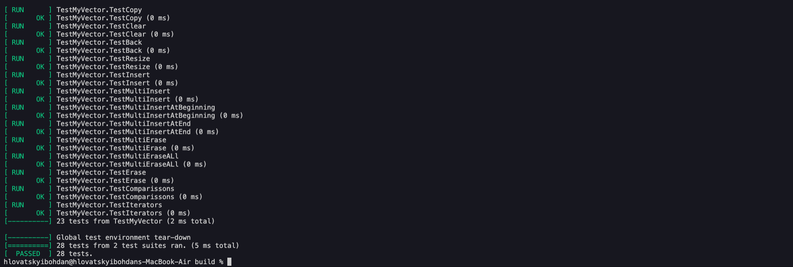

# Lab work <mark>3</mark>: <mark>My Vector, Array</mark>
Authors (team): <mark>bohdan hlovatskyi: https://github.com/bohdanhlovatskyi</mark><br>

## Prerequisites

- C++ 20 (uses some features from that)
- GTest to run tests (seperate CMakeLists for that)

### Compilation

- to run the example
```sh
./compile.sh
bin/example
```

- to run the tests
```sh
cd test
mkdir build
cd build
cmake .. && make && ./tests
```

### Installation

For MacOS / Linux, GTest installation is trivial (simply use your packet manager), for Windows I have no idea.

### Important!

Everything was tested only on MacOS, thus no Valgrind, no PVSStudio and no proper installation guide.

### Results


